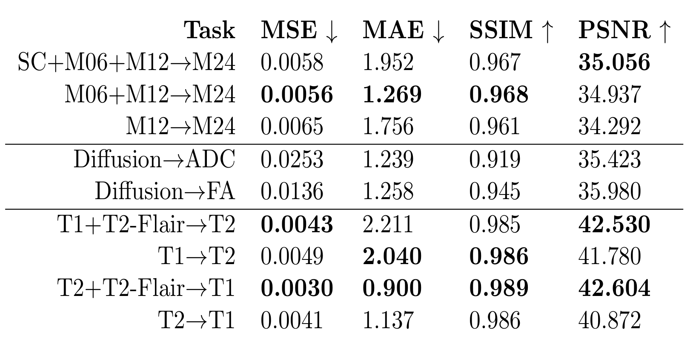
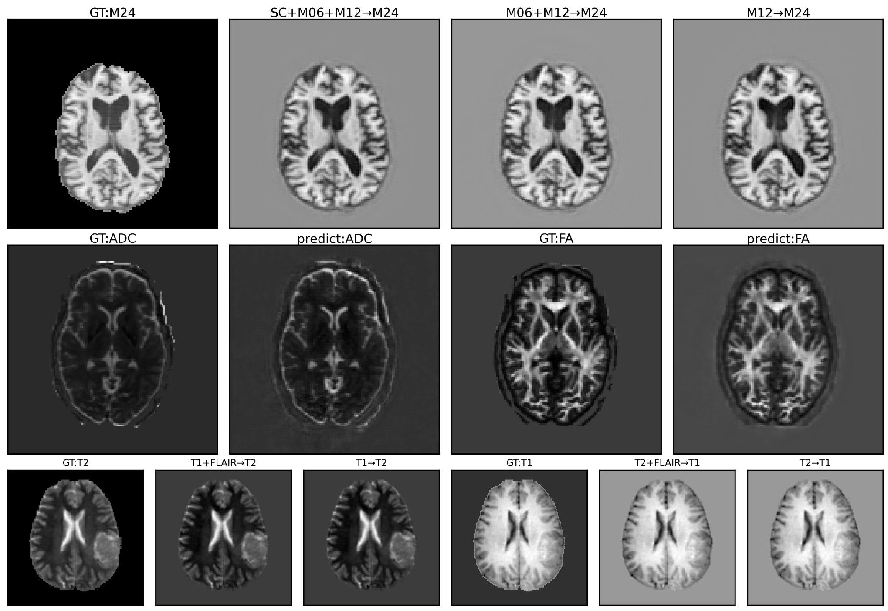

<div align="center">  

## Multichannel input pixelwise regression 3D U-Nets for medical image estimation with 3 applications in brain MRI

[](https://doi.org/10.5281/zenodo.4679670)

</div>

## Description
This is the official Pytorch implementation of Multichannel input pixelwise regression 3D U-Nets for medical image estimation with 3 applications in brain MRI, submitted at MIDL 2021 as short paper.

## Abstract
The U-Net is a robust general-purpose deep learning architecture
  designed for semantic segmentation of medical images, and has
  been extended to 3D for volumetric applications such as
  magnetic resonance imaging (MRI) of the human brain. An
  adaptation of the U-Net to output pixelwise regression
  values, instead of class labels, based on multichannel input data
  has been developed in the remote sensing satellite imaging
  research domain. The pixelwise regression U-Net has only received
  limited consideration as a deep learning architecture in medical
  imaging for the image estimation/synthesis problem, and the
  limited work so far did not consider the application of 3D
  multichannel inputs. In this paper, we propose the use of the
  multichannel input pixelwise regression 3D U-Net (rUNet) for
  estimation of medical images. Our findings demonstrate that this
  approach is robust and versatile and can be applied to predicting
  a pending MRI examination of patients with Alzheimer's disease
  based on previous rounds of imaging, can perform medical image
  reconstruction (parametric mapping) in diffusion MRI, and can be
  applied to the estimation of one type of MRI examination from a
  collection of other types. Results demonstrate that the rUNet
  represents a single deep learning architecture capable of solving
  a variety of image estimation problems.

## Preprocessing
In application 1 (predicting a pending MRI examination of patients with Alzheimer's disease), We did skull stripping and co-registered each volume to the corresponding target. The following are commands we have used:

skull stripping:
```bash
bet <input> <output> -f 0.15 -S -B
```

Registration (using FreeSurfer):
```bash
mri_robust_register --mov <mov.mgz> --dst <dst.mgz> --lta <m2d.lta> --mapmov <aligned.mgz> --iscale --satit --affine 
```

## Model
We use a 5-level 3D U-Net architecture, with Leaky ReLU activation (), learning rate (), Adam optimizer, mean average error  (MAE) loss function, z-score intensity normalization and  co-registered volumes resized to 128x128x128 for each tasks. Batch size was 3 in applications 1 and 3, and 1 in application 2. We compare all approaches with mean squarederror (MSE), MAE, structural similarity index measure (SSIM), and peak signal to noise ratio (PSNR).

## Results
### Qualitative Results

### Quantitative Results


## Citation
If any of the results in this paper or code are useful for your research, please cite the corresponding paper:
```
@inproceedings{Wang2021,
   author = {Jueqi Wang and Derek Berger and David Mattie and Jacob Levman},
   journal = {International conference on Medical Imaging with Deep Learning},
   title = {Multichannel input pixelwise regression 3D U-Nets for medical image estimation with 3 applications in brain MRI},
   year = {2021},
}
```
